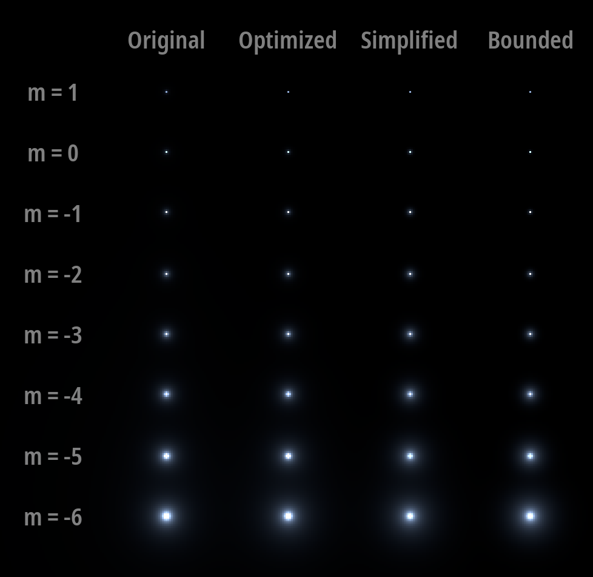

# Celestia Star Renderer

Realistic star rendering algorithms developed for the [Celestia Project](https://github.com/CelestiaProject) to assist with the transition to gamma corrected rendering. The repository was created because the [original issue](https://github.com/CelestiaProject/Celestia/issues/1948) updates became too complex to maintain.

## Ground

- Celestia star styles don't model their actual difference in brightness physically accurately.
- This became even more noticeable in [the branch implementing gamma correction](https://github.com/CelestiaProject/Celestia/tree/srgb-test-v1).

The problem was already noticed and described by Chris Layrel, 2010 forum discussion is [here](https://celestiaproject.space/forum/viewtopic.php?f=10&t=16031). In a roundabout way, it led to [this branch](https://github.com/CelestiaProject/Celestia/tree/new-stars-v2). But, as [onetwothree](https://github.com/375gnu) said, "it's buggy and slow". One of the problems was the squares around bright stars (Gaussians don't have a limit on the angular size, but the shader does).

## Solutions

Several algorithms have been developed with different advantages and disadvantages. They all rely on the photopic point source function (PSF) from [this paper](https://dl.acm.org/doi/10.1145/218380.218466).

- `Original`: Just uses the PSF. Not limited in render size and very slow.
- `Optimized`: Empirically, the PSF was simplified to one term and pre-calculated coefficients selected using the least squares method. Therefore, it became possible to pre-calculate the size of the square within which the glow will be visible. Virtually indistinguishable from the original PSF over the entire brightness range.
- `Simplified`: Repeats the original PSF worse for high brightness, but renders faster.
- `Bounded`: Added reinforced concrete limit on a render square size. Naturally, this makes it impossible to replicate the original PSF, but everything was done to ensure that the rendering was accurate for low brightnesses and the bounding was smooth for high brightness.

The performance ratio of the last three (very estimated): 6:2:1.

All algorithms (except the `Original`) disable glow rendering if the star is not bright enough to fill one pixel. The brightness of stars is specified through the magnitude and can be adjusted through the exposure variable.

Definition of a “convenient linear brightness scale” that is used for all the algorithms: “1 Vega” matches `exposure=1` and the green color component for a `magnitude=0` star illuminates exactly one pixel. Let's link the zero magnitude to the Vegan spectrum from the [CALSPEC database](https://www.stsci.edu/hst/instrumentation/reference-data-for-calibration-and-tools/astronomical-catalogs/calspec) as a standard, and also assume that the green component of the pixel completely follows the green [sensitivity curve of the eye](http://www.cvrl.org/stilesburch10_ind.htm). By element-wise multiplying the two spectra and integrating, I obtain that the unit of the “convenient brightness scale” corresponds to 3.84475 ∙10⁻¹¹ W/m² in SI.

You can configure rendering in `main.py` through its variables.

## Installation

Python version 3.9 or higher is required. On Linux, you may need to replace the `python` command with `python3`.

**Step Zero**: Clone the repository or download the archive using the GitHub web interface. In the console, go to the project root folder.

### Simple installation
1. Install the dependencies with `pip install -r requirements.txt`;
2. Execute `python -u main.py`.

### In virtual environment
1. Create a virtual environment with `python -m venv .venv`;
2. Install the dependencies with `.venv/bin/pip install -r requirements.txt`;
3. Execute `.venv/bin/python -u main.py`.

## Known problems
- Subpixel render will not work well, star is supposed to be strictly in the center. Otherwise, I assume it will lead to unexpected brightness fluctuations unless some kind of the PSF integration by pixel is implemented, but this is expensive. This means that as the DPI increases, the size of stars will decrease.
- The transition between point rendering and glow works for normal use, but breaks down at high angular resolutions (< 0.05-0.03 °/px). Thus, when changing the FOV, the angular size should not be physical, but relative to the FOV.