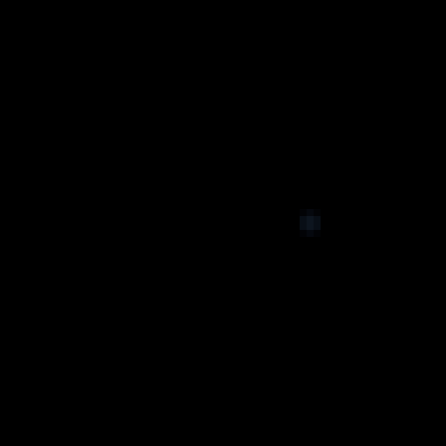
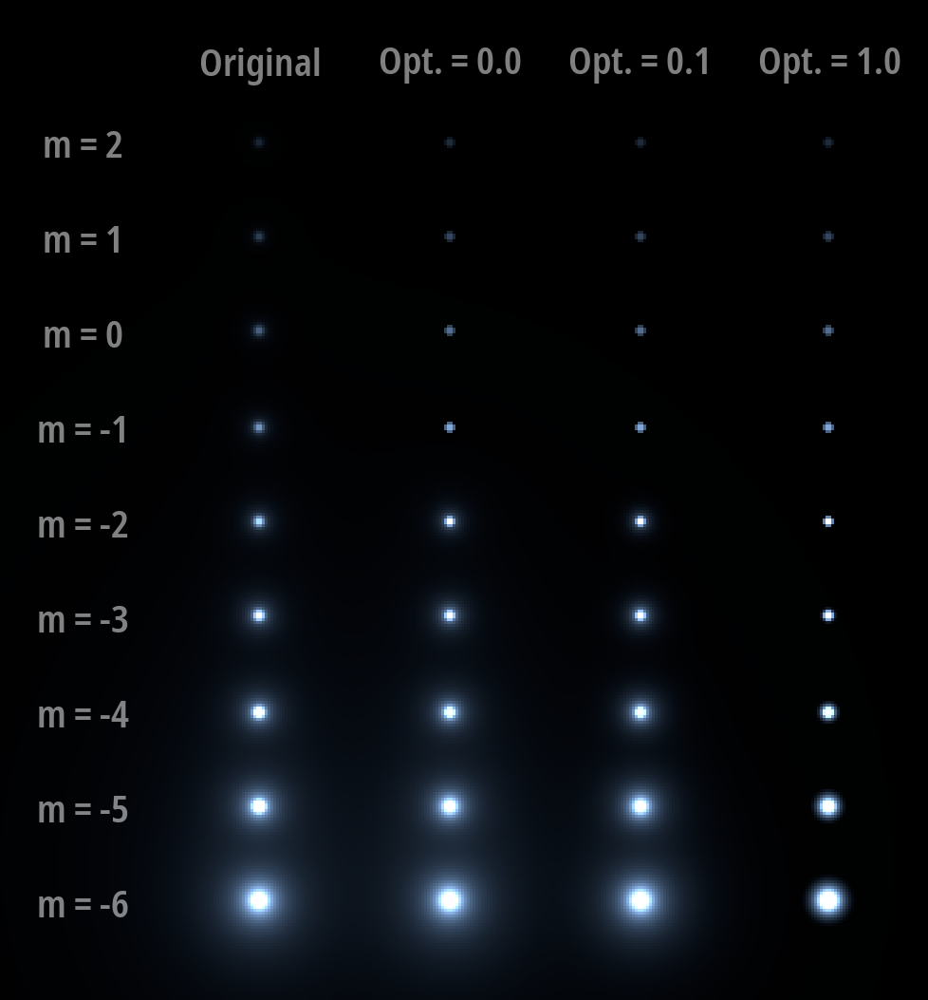
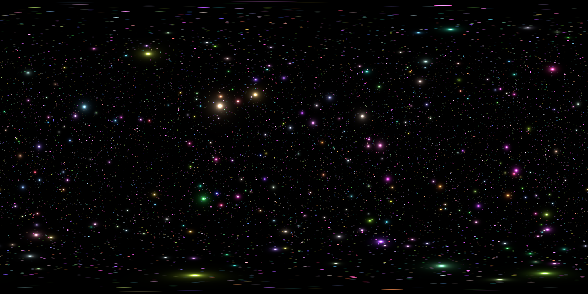

# Celestia Star Renderer

Realistic star rendering method developed for the [Celestia Project](https://github.com/CelestiaProject) to assist with the transition to gamma corrected (sRGB) rendering.

## Ground

- Star styles do not accurately model their physical differences in brightness.
- Gamma correction enhances the effect, making the star field appear flat.

The problem was already noticed and described by Chris Layrel, 2010 forum discussion is [here](https://celestiaproject.space/forum/viewtopic.php?f=10&t=16031) and led to [this branch](https://github.com/CelestiaProject/Celestia/tree/new-stars-v2). But it was “buggy and slow”, with squares around bright stars. The discussion and early development are described in the [issue](https://github.com/CelestiaProject/Celestia/issues/1948).

## Solution

To address these issues, I propose a physically accurate, optimized rendering method. It relies on the photopic point source function (PSF) from [this paper](https://dl.acm.org/doi/10.1145/218380.218466).

The PSF cannot be used as presented. Otherwise, you would either have to apply a convolution to each frame (which is slow) or crop the original, unbounded PSF to a certain radius (which would result in jagged edges). In turn, the proposed method introduces a true final bloom size while only slightly altering the visual appearance. It is also computationally simple.

Brightness of a light source (“radiance”, in terms of dimensionality) is expressed in peak value units. A radiance value of 1 distinguishes between two rendering modes:

1. “Point mode”: a circular linear distribution with a diameter of several pixels.
2. “Eye PSF mode”: an approximation of the actual PSF, but with pre-calculated exact size.

If the source's peak radiance is greater than 1, the second mode's bloom effect is added to the point. This means that the method can be implemented as two separate shaders. Gamma correction is applied at the end.

The interface is implemented as class `RenderEngine`, which is located in [`CSR.py`](CSR.py). Draw a light source on a NumPy array using the `draw_source()` method. Check out the comments in the code for details.

## Examples

### [Animation](example_animation.py)

Vega's color is used as an example. The values were calculated from the spectrum using [TrueColorTools](https://github.com/Askaniy).

The radiance increases logarithmically.

### [Chart](example_chart.py)

The model depends on two parameters: “optimization” and the radius of the point mode. With zero optimization, the model, like the original PSF, is not size-constrained.

The transition peak radiance of 1 is represented by 0 magnitude.

### [Cylindrical map](example_cylindrical_map.py)

10,000 random light sources render in less than a second on any device (except for potatoes).

## Installation

Python version 3.11 or higher is required. Works on Windows/macOS/Linux.

1. Clone the repository or download the archive using the GitHub web interface;
2. Open the console in the project root folder;
3. Create a virtual environment with `python3 -m venv .venv`;
4. Install the dependencies with `.venv/bin/pip install -r requirements.txt`;
5. Execute an example script with `.venv/bin/python example_animation.py`.

## History

The repository and the method were redesigned in 2026. The initial results (from 2023-2024) are stored in [`legacy_algorithms.py`](legacy_algorithms.py).

Not vibe coded!
